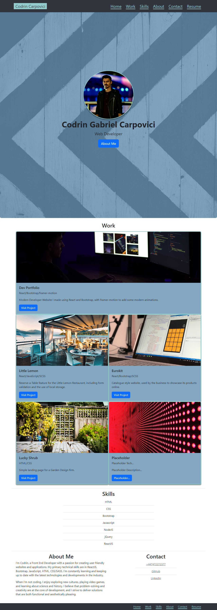

# Bootstrap edX Portfolio

## Description

Personal Web Developer Portfolio. Used to showcase projects I have been working on and for future bootcamp projects. This website is an update to the previous portfolio developed in HTML and CSS. It has been developed using responsive Bootstrap classes, while ensuring accessibility and usability guidelines are followed.

## Table of Contents

* [Installation](#installation)
* [Usage](#usage)
* [Credits](#credits)
* [License](#license)
* [Badges](#badges)

## Installation

N/A

## Usage 

Go To: [codrincarpovici.github.io/bootstrap-portfolio/](https://codrincarpovici.github.io/bootstrap-portfolio/) and view the website. 

On the website you can click the different navigation links in the navbar to get to the respective sections.
On the main page you will see my name, photo and description. From here you can scroll to the work section, where I showcased my projects. The next section covers my skills gained (or that I will gain) from the edX bootcamp.
You can also read the About Me section where I added a summary of myself. 
Next to the about is the Contact Section which also provides links to my contact information which are clickable.
Screen Readers can also follow the semantic structure of the page and it is also mobile-firendly as it's using responsive Bootstrap classes

## Credits

Official Bootstrap Documentation: [getbootstrap.com/](https://getbootstrap.com/)

## License

## Badges

